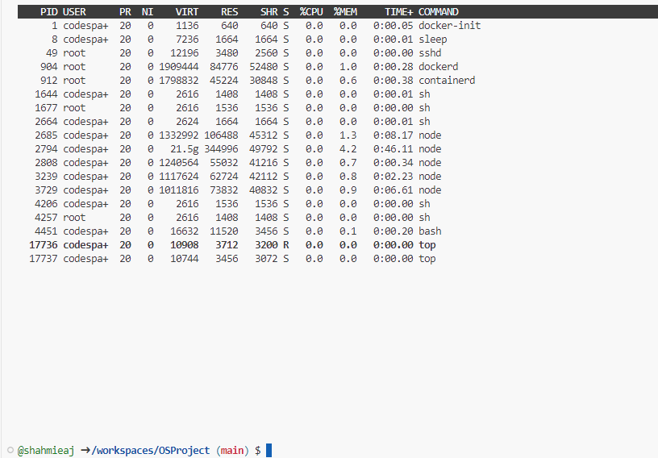
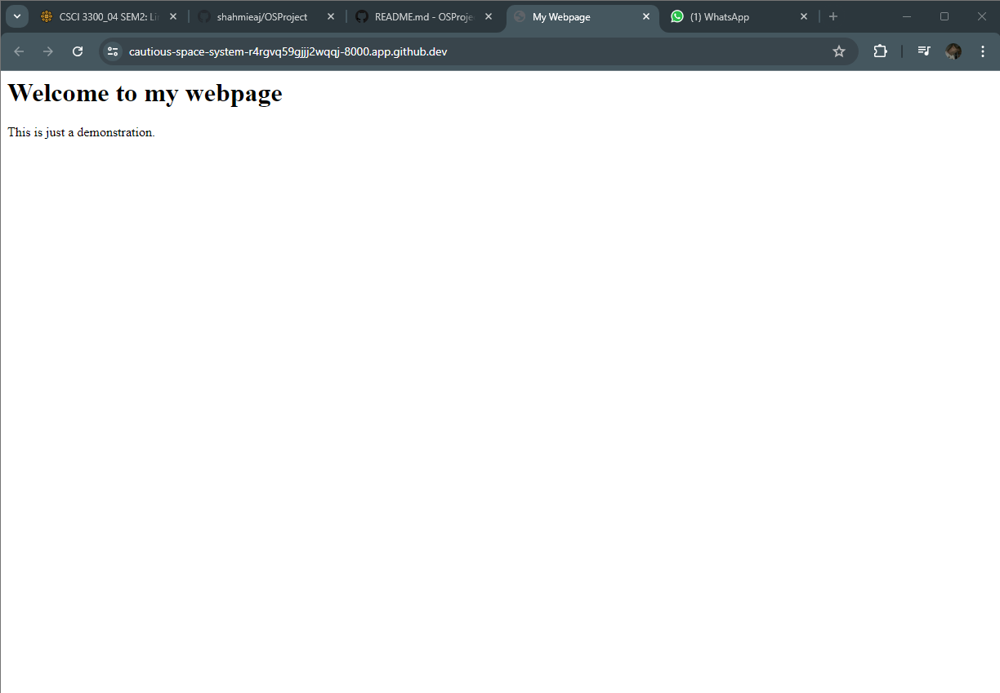

# OSProject Running Containers for Application Development

Group Name: __Type-OS__. 

Section: __Section 4__. 

Team Mates:
1. __Ahmad Afiq bin Syamsul Akram__ and __2211841__
2. __Ahmad Zaed Hakimi bin Rosli Allani__ and __2217059__
3. __Shahmie bin Abd Jalil__ and __2217739__

## Rules
1. You are allowed to have **3 group** members. *Exception* is allowed **IFF (if and only if)** you are allowed to have 4 group members if you are a **multinational** or a **multigender** group. 
2. When you complete the project, make sure to submit the repository link of your cloned project. Make sure all the files are as what you aspect in your repository. 
3. Answer all questions in the **README.md**, in your own repository. Either use the online VSCode, terminal or github to edit. Answers are expected where you see __Fill answer here__.
4. Learn how to use markdown. https://www.w3schools.io/file/markdown-introduction/

## Forking this OS project repository
1. First thing you need in doing this project is to have a github account. Make sure to sign up at https://www.github.com
2. The second thing you need is to fork the OS project repository in your own github account. 

    1. Go to https://github.com/joeynor/OSProject and click fork to copy the project into your own repository
    2. Make sure that the new fork is now in your own repository

***Questions:***

1. What is the link of the fork OSProject in your repository. __https://github.com/shahmieaj/OSProject__.
2. How many files and folders are in this repository. __1 Readme.md file and 1 images folder__.


## Exploring github codespaces

1. The next thing that we will be doing is exploring codespaces. First of all, read about codespaces https://docs.github.com/en/codespaces/overview#what-is-a-codespace
2. Then go to the link https://github.com/codespaces and we shall start a new codespace.  
3. Click on ***New codespace***.
4. Choose your own OSProject repository to start your codespace.

 

5. Once you have created you codespace, you will see the following. You might already be familiar with this, since it will look similar to VSCode. 

 

6. You will see the [README file](./README.md) file. One is a preview of how it looks like on the web, and the other is the editing view in markdown language. 
7. Edit the [README file](./README.md). Make sure you have your group details correct, ie, group name, section and team members along with their matric IDs. 
8. Once you have finish editing, click File->Save or ***ctrl-s*** to save it. 
9. After saving, you will notice an M or U next to your file. You will need to commit any changes, whenever you make changes so that it is uploaded to the github repository. 

 

10. Click on the source control, hint: its on the left side panel, and it will list down the files that have been modified or updated. Click on commit. It will then ask you "Would you like to stage all your changes and commit them directly?" Just say yes, and a new tab will appear. Type a message to log what you have done, and click on the check mark. 

 

11. After that, sync the changes to the main repository. 
12. Make sure to commit and sync your files to the main repository, or else, your work will be lost since it is not saved into the main repository when you submit your project.

***Questions:***

1. What is default OS used to run the virtual environment for codespaces. __Linux Ubuntu__.
2. What are the two options of ram, disk and vcpu configuration you can have in running codespaces . __2 cores, 8 GB RAM, 32 GB storage and 4 cores, 16 GB RAM, 32 GB storage__.
3. Why must we commit and sync our current work on source control? __So that the work made will be save into the main repository__.

## Exploring the Terminal

1. Look at the TERMINAL tab. Explore and run commands according to the questions below. 
2. You can include your answers as images, or cut and paste the output here. If you are cutting and pasting your answers, wrap your answers in the codeblock clause in markdown. For example, if i run the command **whoami** the the output would look like the one below.
```bash
@joeynor ➜ /workspaces/OSProject (main) $ whoami 
codespace
```


***Questions:***

Look at the TERMINAL tab. Run the following commands and provide the output here. 

1. Run the command **pwd** .  
```bash
@shahmieaj ➜ /workspaces/OSProject (main) $ pwd 
/workspaces/OSProject
```
2. Run the command **cat /etc/passwd** . 
```bash
@shahmieaj ➜ /workspaces/OSProject (main) $ cat /etc/passwd 
root:x:0:0:root:/root:/bin/bash
daemon:x:1:1:daemon:/usr/sbin:/usr/sbin/nologin
bin:x:2:2:bin:/bin:/usr/sbin/nologin
sys:x:3:3:sys:/dev:/usr/sbin/nologin
sync:x:4:65534:sync:/bin:/bin/sync
games:x:5:60:games:/usr/games:/usr/sbin/nologin
man:x:6:12:man:/var/cache/man:/usr/sbin/nologin
lp:x:7:7:lp:/var/spool/lpd:/usr/sbin/nologin
mail:x:8:8:mail:/var/mail:/usr/sbin/nologin
news:x:9:9:news:/var/spool/news:/usr/sbin/nologin
uucp:x:10:10:uucp:/var/spool/uucp:/usr/sbin/nologin
proxy:x:13:13:proxy:/bin:/usr/sbin/nologin
www-data:x:33:33:www-data:/var/www:/usr/sbin/nologin
backup:x:34:34:backup:/var/backups:/usr/sbin/nologin
list:x:38:38:Mailing List Manager:/var/list:/usr/sbin/nologin
irc:x:39:39:ircd:/var/run/ircd:/usr/sbin/nologin
gnats:x:41:41:Gnats Bug-Reporting System (admin):/var/lib/gnats:/usr/sbin/nologin
nobody:x:65534:65534:nobody:/nonexistent:/usr/sbin/nologin
_apt:x:100:65534::/nonexistent:/usr/sbin/nologin
systemd-timesync:x:101:101:systemd Time Synchronization,,,:/run/systemd:/usr/sbin/nologin
systemd-network:x:102:103:systemd Network Management,,,:/run/systemd:/usr/sbin/nologin
systemd-resolve:x:103:104:systemd Resolver,,,:/run/systemd:/usr/sbin/nologin
messagebus:x:104:105::/nonexistent:/usr/sbin/nologin
codespace:x:1000:1000::/home/codespace:/bin/bash
sshd:x:105:65534::/run/sshd:/usr/sbin/nologin
```
3. Run the command **df** . 
```bash
@shahmieaj ➜ /workspaces/OSProject (main) $ df 
Filesystem     1K-blocks     Used Available Use% Mounted on
overlay         32847680 10381172  20772408  34% /
tmpfs              65536        0     65536   0% /dev
shm                65536        8     65528   1% /dev/shm
/dev/root       30298176 24493520   5788272  81% /vscode
/dev/sda1       46127956      104  43752276   1% /tmp
/dev/loop3      32847680 10381172  20772408  34% /workspaces
```
4. Run the command **du** .
```bash
@shahmieaj ➜ /workspaces/OSProject (main) $ du 
4       ./.git/lfs/tmp
8       ./.git/lfs
8       ./.git/objects/f2
8       ./.git/objects/eb
8       ./.git/objects/83
8       ./.git/objects/0d
12      ./.git/objects/b5
12      ./.git/objects/72
8       ./.git/objects/47
8       ./.git/objects/7b
8       ./.git/objects/74
12      ./.git/objects/29
8       ./.git/objects/20
8       ./.git/objects/f6
8       ./.git/objects/81
12      ./.git/objects/b3
8       ./.git/objects/fc
8       ./.git/objects/4b
12      ./.git/objects/14
8       ./.git/objects/a6
8       ./.git/objects/c5
8       ./.git/objects/2b
8       ./.git/objects/52
8       ./.git/objects/93
8       ./.git/objects/97
12      ./.git/objects/ff
8       ./.git/objects/41
12      ./.git/objects/2e
8       ./.git/objects/3f
12      ./.git/objects/e5
12      ./.git/objects/62
8       ./.git/objects/b2
8       ./.git/objects/b6
8       ./.git/objects/cb
8       ./.git/objects/71
8       ./.git/objects/86
8       ./.git/objects/d8
8       ./.git/objects/de
12      ./.git/objects/73
8       ./.git/objects/c3
8       ./.git/objects/91
8       ./.git/objects/4f
12      ./.git/objects/17
8       ./.git/objects/a4
8       ./.git/objects/58
8       ./.git/objects/e7
8       ./.git/objects/fd
1828    ./.git/objects/pack
8       ./.git/objects/4a
8       ./.git/objects/b9
8       ./.git/objects/fa
12      ./.git/objects/af
8       ./.git/objects/fe
16      ./.git/objects/fb
12      ./.git/objects/e4
8       ./.git/objects/f7
8       ./.git/objects/3a
12      ./.git/objects/70
12      ./.git/objects/3d
8       ./.git/objects/49
8       ./.git/objects/96
8       ./.git/objects/60
12      ./.git/objects/1c
8       ./.git/objects/0b
8       ./.git/objects/04
8       ./.git/objects/cd
8       ./.git/objects/c6
8       ./.git/objects/24
8       ./.git/objects/ab
12      ./.git/objects/6e
12      ./.git/objects/44
12      ./.git/objects/64
8       ./.git/objects/c0
8       ./.git/objects/38
12      ./.git/objects/98
12      ./.git/objects/d2
8       ./.git/objects/a3
4       ./.git/objects/info
8       ./.git/objects/1b
8       ./.git/objects/e9
2536    ./.git/objects
12      ./.git/refs/remotes/origin
16      ./.git/refs/remotes
8       ./.git/refs/heads
4       ./.git/refs/tags
32      ./.git/refs
12      ./.git/logs/refs/remotes/origin
16      ./.git/logs/refs/remotes
8       ./.git/logs/refs/heads
28      ./.git/logs/refs
36      ./.git/logs
68      ./.git/hooks
4       ./.git/branches
8       ./.git/info
2728    ./.git
1972    ./images
4724    .
```
5. Run the command **ls** . 
```bash
@shahmieaj ➜ /workspaces/OSProject (main) $ ls 
README.md  images
```
6. Run the command **ls -asl** . 
```bash
@shahmieaj ➜ /workspaces/OSProject (main) $ ls -asl
total 40
 4 drwxrwxrwx+ 4 codespace root  4096 Jun 23 08:58 .
 4 drwxr-xrwx+ 5 codespace root  4096 Jun 23 08:58 ..
 4 drwxrwxrwx+ 9 codespace root  4096 Jun 23 09:08 .git
24 -rw-rw-rw-  1 codespace root 22057 Jun 23 09:23 README.md
 4 drwxrwxrwx+ 2 codespace root  4096 Jun 23 08:58 images
```
7. Run the command **free -h** . 
```bash
@shahmieaj ➜ /workspaces/OSProject (main) $ free -h 
              total        used        free      shared  buff/cache   available
Mem:          7.7Gi       1.4Gi       226Mi        67Mi       6.1Gi       6.0Gi
Swap:            0B          0B          0B
```
8. Run the command **cat /proc/cpuinfo** . 
```bash
@shahmieaj ➜ /workspaces/OSProject (main) $ cat /proc/cpuinfo 
processor       : 0
vendor_id       : AuthenticAMD
cpu family      : 25
model           : 1
model name      : AMD EPYC 7763 64-Core Processor
stepping        : 1
microcode       : 0xffffffff
cpu MHz         : 3241.840
cache size      : 512 KB
physical id     : 0
siblings        : 2
core id         : 0
cpu cores       : 1
apicid          : 0
initial apicid  : 0
fpu             : yes
fpu_exception   : yes
cpuid level     : 13
wp              : yes
flags           : fpu vme de pse tsc msr pae mce cx8 apic sep mtrr pge mca cmov pat pse36 clflush mmx fxsr sse sse2 ht syscall nx mmxext fxsr_opt pdpe1gb rdtscp lm constant_tsc rep_good nopl tsc_reliable nonstop_tsc cpuid extd_apicid aperfmperf pni pclmulqdq ssse3 fma cx16 pcid sse4_1 sse4_2 movbe popcnt aes xsave avx f16c rdrand hypervisor lahf_lm cmp_legacy svm cr8_legacy abm sse4a misalignsse 3dnowprefetch osvw topoext invpcid_single vmmcall fsgsbase bmi1 avx2 smep bmi2 erms invpcid rdseed adx smap clflushopt clwb sha_ni xsaveopt xsavec xgetbv1 xsaves clzero xsaveerptr rdpru arat npt nrip_save tsc_scale vmcb_clean flushbyasid decodeassists pausefilter pfthreshold v_vmsave_vmload umip vaes vpclmulqdq rdpid fsrm
bugs            : sysret_ss_attrs null_seg spectre_v1 spectre_v2 spec_store_bypass srso
bogomips        : 4890.85
TLB size        : 2560 4K pages
clflush size    : 64
cache_alignment : 64
address sizes   : 48 bits physical, 48 bits virtual
power management:

processor       : 1
vendor_id       : AuthenticAMD
cpu family      : 25
model           : 1
model name      : AMD EPYC 7763 64-Core Processor
stepping        : 1
microcode       : 0xffffffff
cpu MHz         : 3241.784
cache size      : 512 KB
physical id     : 0
siblings        : 2
core id         : 0
cpu cores       : 1
apicid          : 1
initial apicid  : 1
fpu             : yes
fpu_exception   : yes
cpuid level     : 13
wp              : yes
flags           : fpu vme de pse tsc msr pae mce cx8 apic sep mtrr pge mca cmov pat pse36 clflush mmx fxsr sse sse2 ht syscall nx mmxext fxsr_opt pdpe1gb rdtscp lm constant_tsc rep_good nopl tsc_reliable nonstop_tsc cpuid extd_apicid aperfmperf pni pclmulqdq ssse3 fma cx16 pcid sse4_1 sse4_2 movbe popcnt aes xsave avx f16c rdrand hypervisor lahf_lm cmp_legacy svm cr8_legacy abm sse4a misalignsse 3dnowprefetch osvw topoext invpcid_single vmmcall fsgsbase bmi1 avx2 smep bmi2 erms invpcid rdseed adx smap clflushopt clwb sha_ni xsaveopt xsavec xgetbv1 xsaves clzero xsaveerptr rdpru arat npt nrip_save tsc_scale vmcb_clean flushbyasid decodeassists pausefilter pfthreshold v_vmsave_vmload umip vaes vpclmulqdq rdpid fsrm
bugs            : sysret_ss_attrs null_seg spectre_v1 spectre_v2 spec_store_bypass srso
bogomips        : 4890.85
TLB size        : 2560 4K pages
clflush size    : 64
cache_alignment : 64
address sizes   : 48 bits physical, 48 bits virtual
power management:
```
9. Run the command **top** and type **q** to quit. 

  

10. Run the command **uname -a**. 
```bash
@shahmieaj ➜ /workspaces/OSProject (main) $ uname -a 
Linux codespaces-0d6d7a 6.5.0-1021-azure #22~22.04.1-Ubuntu SMP Tue Apr 30 16:08:18 UTC 2024 x86_64 x86_64 x86_64 GNU/Linux
```
11. What is the available free memory in the system. __226Mi__.
12. What is the available disk space mounted on /workspace. __20772408__.
13. Name the version and hardware architecture of the linux Virtual environment. __Linux codespaces-0d6d7a 6.5.0-1021-azure #22~22.04.1-Ubuntu SMP Tue Apr 30 16:08:18 UTC 2024 x86_64 x86_64 x86_64 GNU/Linux__.
14. What is the difference between **ls** vs **ls -asl**. __The ls command will list simple filenames while the ls -als command will list the detailed version__.
15. What is the TLB size of the Virtual CPU. __2560 4K pages__.
16. What is the CPU speed of the Virtual CPU. __3241.840 MHz__.
17. What is the top running process that consumes the most CPU cycles. __docker-init__.

## Running your own container instance.

1. At the terminal, run a linux instance. By typing the following command. 
```
docker pull debian
docker run --detach -it debian
```
```bash
@shahmieaj ➜ /workspaces/OSProject (main) $ docker pull debian
Using default tag: latest
latest: Pulling from library/debian
fea1432adf09: Pull complete 
Digest: sha256:a92ed51e0996d8e9de041ca05ce623d2c491444df6a535a566dabd5cb8336946
Status: Downloaded newer image for debian:latest
docker.io/library/debian:latest
@shahmieaj ➜ /workspaces/OSProject (main) $ docker run --detach -it debian
3081078d6b1fbcead33af57cbc19175c4273664dff7317d5cccdbeb439f57caf
```
2. This will run the debian container. To check if the debian container is running, type
```bash
@joeynor ➜ /workspaces/OSProject (main) $ docker ps -a
CONTAINER ID   IMAGE     COMMAND   CREATED         STATUS         PORTS     NAMES
f65be1987f84   debian    "bash"    4 minutes ago   Up 4 minutes             romantic_jackson
```
```bash
@shahmieaj ➜ /workspaces/OSProject (main) $ docker ps -a
CONTAINER ID   IMAGE     COMMAND   CREATED              STATUS              PORTS     NAMES
3081078d6b1f   debian    "bash"    About a minute ago   Up About a minute             adoring_cray
```
3. Keep note of the name used by your container, this is usually given random names unless you specify your own name. Now run a bash command on the container. Make sure you use the name of your container instead of the one shown here. 
```bash
docker exec -i -t romantic_jackson /bin/bash
```
```bash
@shahmieaj ➜ /workspaces/OSProject (main) $ docker exec -i -t adoring_cray /bin/bash
```
4. Create a file on the container. First you must make sure you are in the bash command prompt of the container. The container is new, and does not have any software other than the debian OS. To create a new file, you will need an editor installed. In the bash shell of the container, run the package manager apt-get to install nano text editor. 

```bash
root@f65be1987f84:~# apt-get update      

root@f65be1987f84:~# apt-get install nano

root@f65be1987f84:~# cd /root

root@f65be1987f84:~# nano helloworld.txt
```

5. Edit your helloworld.txt, create your messsage and save by typing ctrl-X. Once saved, explore using the container to see where the file is located. Then exit the shell, by typing **exit**.

6. Stop the container and run **docker ps -a**, and restart the container again. Is your file in the container still available?
```bash 
@joeynor ➜ /workspaces/OSProject (main) $ docker stop romantic_jackson

@joeynor ➜ /workspaces/OSProject (main) $ docker ps -a
CONTAINER ID   IMAGE     COMMAND   CREATED          STATUS                        PORTS     NAMES
f65be1987f84   debian    "bash"    19 minutes ago   Exited (137) 18 seconds ago             romantic_jackson

@joeynor ➜ /workspaces/OSProject (main) $ docker restart romantic_jackson
```
```bash
@shahmieaj ➜ /workspaces/OSProject (main) $ docker stop adoring_cray

@shahmieaj ➜ /workspaces/OSProject (main) $ docker ps -a
CONTAINER ID   IMAGE     COMMAND   CREATED          STATUS                        PORTS     NAMES
3081078d6b1f   debian    "bash"    14 minutes ago   Exited (137) 19 seconds ago             adoring_cray

@shahmieaj ➜ /workspaces/OSProject (main) $ docker restart adoring_cray
```

7. Stop the container and delete the container. What happened to your helloworld.txt?

```bash 
@joeynor ➜ /workspaces/OSProject (main) $ docker stop romantic_jackson

@joeynor ➜ /workspaces/OSProject (main) $ docker ps -a
CONTAINER ID   IMAGE     COMMAND   CREATED          STATUS                        PORTS     NAMES
f65be1987f84   debian    "bash"    19 minutes ago   Exited (137) 18 seconds ago             romantic_jackson

@joeynor ➜ /workspaces/OSProject (main) $ docker rm romantic_jackson
```
```bash 
@shahmieaj ➜ /workspaces/OSProject (main) $ docker stop adoring_cray

@shahmieaj ➜ /workspaces/OSProject (main) $ docker ps -a
CONTAINER ID   IMAGE     COMMAND   CREATED          STATUS                        PORTS     NAMES
3081078d6b1f   debian    "bash"    18 minutes ago   Exited (137) 11 seconds ago             adoring_cray

@shahmieaj ➜ /workspaces/OSProject (main) $ docker rm adoring_cray
```

__Our helloworld.txt is lost as the container was deleted__

***Questions:***

1. Are files in the container persistent. Why not? __No. Containers are designed to be lightweight and ephemeral, storing changes in a temporary writable layer that is discarded when the container stops.__
2. Can we run two, or three instances of debian linux? __Yes, multiple instances of Debian Linux can be run simultaneously on different virtual machines, containers, or physical machines.__

## Running your own container with persistent storage

1. In the previous experiment, you might have notice that containers are not persistent. To make storage persistent, you will need to mount them. 
At the terminal, create a new directory called **myroot**, and run a instance of debian linux and mount myroot to the container. Find out the exact path of my root, and mount it as the root folder in the debian container. 
2. Create a file in /root on the container, the files should also appear in myroot of your host VM.

```bash 
@joeynor ➜ /workspaces/OSProject (main) $ mkdir myroot
@joeynor ➜ /workspaces/OSProject (main) $ cd myroot/
@joeynor ➜ /workspaces/OSProject/myroot (main) $ pwd
/workspaces/OSProject/myroot

@joeynor ➜ /workspaces/OSProject/myroot (main) $ docker run --detach -it -v /workspaces/OSProject/myroot:/root debian
```
```bash
@shahmieaj ➜ /workspaces/OSProject (main) $ mkdir myroot
@shahmieaj ➜ /workspaces/OSProject (main) $ cd myroot/
@shahmieaj ➜ /workspaces/OSProject/myroot (main) $ pwd
/workspaces/OSProject/myroot

@shahmieaj ➜ /workspaces/OSProject/myroot (main) $ docker run --detach -it -v /workspaces/OSProject/myroot:/root debian
cb9f02626d68b6ce4a2b8af46c2d5b6dbf9f4eb6f26039a24358aa1c1a40eab5
```

***Questions:***

1. Check the permission of the files created in myroot, what user and group is the files created in docker container on the host virtual machine? . ***(2 mark)*** 
```bash
@shahmieaj ➜ /workspaces/OSProject/myroot (main) $ ls
helloworld.txt

@shahmieaj ➜ /workspaces/OSProject/myroot (main) $ ls -l
total 4
-rw-rw-rw- 1 root root 6 Jun 23 11:07 helloworld.txt
```
2. Can you change the permission of the files to user codespace.  You will need this to be able to commit and get points for this question. ***(2 mark)***
```bash
//use sudo and chown
sudo chown -R codespace:codespace myroot

```
```bash
@shahmieaj ➜ /workspaces/OSProject/myroot (main) $ sudo chown -R codespace:codespace /workspaces/OSProject/myroot
@shahmieaj ➜ /workspaces/OSProject/myroot (main) $ 
```

## You are on your own, create your own static webpage

1. Create a directory called webpage in your host machine
```bash
@shahmieaj ➜ /workspaces/OSProject/myroot (main) $ mkdir ~/webpage

@shahmieaj ➜ /workspaces/OSProject/myroot (main) $ cd ~/webpage
```
2. Inside the directory, create a page index.html, with any content you would like
```bash
@shahmieaj ➜ ~/webpage $ echo "<html><head><title>My Webpage</title></head><body><h1>Welcome to my webpage</h1><p>This is just a demonstration.</p></body></html>" > index.html
```
3. Then, run the apache webserver and mount the webpage directory to it. Hint:
```bash
## the -p 8080:80 flag points the host port 8080 to the container port 80

docker run --detach -v /workspaces/OSProject/webpage:/usr/local/apache2/htdocs/ -p 8080:80 httpd
```
```bash
@shahmieaj ➜ ~/webpage $ docker run --detach -v ~/webpage:/usr/local/apache2/htdocs/ -p 8000:80 httpd
574f0e23c2fbb56ed1125af4b33f6329ebaf705259b00423b430a1430db58e59
```

4. If it works, codespace will trigger a port assignment and provide a URL for you to access your webpage like the one below.

 


5. You can also see the Port in the **PORTS** tab, next to the terminal tab.

6. You can then access your website by adding an index.html towards the end of your url link, like the one below. 

 

***Questions:***

1. What is the permission of folder /usr/local/apache/htdocs and what user and group owns the folder? .
```bash
@shahmieaj ➜ ~/webpage $ ls -l
total 4
-rw-r--r-- 1 codespace codespace 131 Jun 23 11:30 index.html
```

2. What port is the apache web server running. __8000__.
3. What port is open for http protocol on the host machine? 
```bash
@shahmieaj ➜ ~/webpage $ netstat -tuln | grep :800
tcp        0      0 0.0.0.0:8000            0.0.0.0:*               LISTEN     
tcp6       0      0 :::8000                 :::*                    LISTEN     
@shahmieaj ➜ ~/webpage $ netstat -tuln | grep :80
tcp        0      0 0.0.0.0:8000            0.0.0.0:*               LISTEN     
tcp        0      0 0.0.0.0:8080            0.0.0.0:*               LISTEN     
tcp6       0      0 :::8000                 :::*                    LISTEN     
tcp6       0      0 :::8080                 :::*                    LISTEN 
```

## Create SUB Networks

1. In docker, you can create your own private networks where you can run multiple services, in this part, we will create two networks, one called bluenet and the other is rednet
2. Run the docker create network to create you networks like the ones below
```bash
## STEP 1:
## Create Networks ##
docker network create bluenet
docker network create rednet`

## STEP 2: (automatically running)
## Create (1) Container in background called "c1" running busybox image ##
docker run -itd --net bluenet --name c1 busybox sh
docker run -itd --net rednet --name c2 busybox sh
```

```bash
## CREATING NETWORK ##
@shahmieaj ➜ /workspaces/OSProject (main) $ docker network create bluenet
75a9c2ea7290cc5d97cd79f388212347932415844cdd6e4822d2c3db214e3828

@shahmieaj ➜ /workspaces/OSProject (main) $ docker network create rednet
413f8b95770486a9ae573e2b9cffff3950b04374febbe7ca14b7249ccfe698cb
```
```bash
## CREATE CONTAINERS ##
@shahmieaj ➜ /workspaces/OSProject (main) $ docker run -itd --net bluenet --name c1 busybox sh
Unable to find image 'busybox:latest' locally
latest: Pulling from library/busybox
ec562eabd705: Pull complete 
Digest: sha256:9ae97d36d26566ff84e8893c64a6dc4fe8ca6d1144bf5b87b2b85a32def253c7
Status: Downloaded newer image for busybox:latest
c77527b801dec968f261acc8b4638b0840e1c787dc7257afa952cc57f7326078

@shahmieaj ➜ /workspaces/OSProject (main) $ docker run -itd --net rednet --name c2 busybox sh
9252791298eced62f1fea82de34f2b58d8d23f822c638b77511d6d250de5b583
```

***Questions:***

1. Describe what is busybox and what is command switch **--name** is for? . __Busybox is a software that combines tiny version of many common unix and --name command switch allows us to specify custom name for the container__.
2. Explore the network using the command ```docker network ls```, show the output of your terminal.
```bash
@shahmieaj ➜ /workspaces/OSProject (main) $ docker network ls
NETWORK ID     NAME      DRIVER    SCOPE
75a9c2ea7290   bluenet   bridge    local
3daefc7b48f6   bridge    bridge    local
1a8698ac8e0c   host      host      local
5fa8c04cae7f   none      null      local
413f8b957704   rednet    bridge    local
```

3. Using ```docker inspect c1``` and ```docker inspect c2``` inscpect the two network. What is the gateway of bluenet and rednet.? __Gateway for bluenet :172.18.0.1, Gateway for rednet :172.19.0.1__.
4. What is the network address for the running container c1 and c2? __c1 Network Address :172.18.0.0, c2 Network Address :172.19.0.0__.
5. Using the command ```docker exec c1 ping c2```, which basically tries to do a ping from container c1 to c2. Are you able to ping? Show your output . 
__We are unable to ping__
```bash
@shahmieaj ➜ /workspaces/OSProject (main) $ docker exec c1 ping c2
ping: bad address 'c2'
```

## Bridging two SUB Networks
1. Let's try this again by creating a network to bridge the two containers in the two subnetworks
```
docker network create bridgenet
docker network connect bridgenet c1
docker network connect bridgenet c2
docker exec c1 ping c2
```

```bash
@shahmieaj ➜ /workspaces/OSProject (main) $ docker network create bridgenet
21c8dcbcfbfeb7e7a776f24b9ad614c68a26010327928a48ff23d3b1c100d83f

@shahmieaj ➜ /workspaces/OSProject (main) $ docker network connect bridgenet c1

@shahmieaj ➜ /workspaces/OSProject (main) $ docker network connect bridgenet c2
```

***Questions:***

1. Are you able to ping? Show your output . ***(1 mark)*** __Fill answer here__.
2. What is different from the previous ping in the section above? ***(1 mark)*** __Fill answer here__.

## Intermediate Level (10 marks bonus)

### Node.js and MySQL in Docker Containers

This guide will help you set up a simple Node.js website that retrieves a random row from a MySQL database. Both the MySQL server and the Node.js server will run in separate Docker containers on two separate networks. Your job is to make it work by making the two containers in two separate network bridged together.

#### Step 1: Set Up the Docker Network

Create a Docker network to for the two containers.
For mysql, call it **mysqlnet** for nodejs call it **nodejsnet** .

#### Step 2: Set Up the MySQL Container

Run a MySQL container on the created network.

```sh
docker run --name mysql-container --network mysqlnet -e MYSQL_ROOT_PASSWORD=rootpassword -e MYSQL_DATABASE=mydatabase -e MYSQL_USER=myuser -e MYSQL_PASSWORD=mypassword -d mysql:latest
```

#### Step 3: Set Up the Node.js Container

1. **Create a directory for your Node.js application and initialize it.**

    ```sh
    mkdir nodejs-app
    cd nodejs-app
    npm init -y
    npm install express mysql
    ```

2. **Create a file named `index.js` with the following content:**

    ```js
    const express = require('express');
    const mysql = require('mysql');

    const app = express();
    const port = 3000;

    // Create a MySQL connection
    const connection = mysql.createConnection({
      host: 'mysql-container',
      user: 'myuser',
      password: 'mypassword',
      database: 'mydatabase'
    });

    // Connect to MySQL
    connection.connect((err) => {
      if (err) {
        console.error('Error connecting to MySQL:', err);
        return;
      }
      console.log('Connected to MySQL');
    });

    // Define a route to get a random row
    app.get('/random', (req, res) => {
      const query = 'SELECT * FROM mytable ORDER BY RAND() LIMIT 1';
      connection.query(query, (err, results) => {
        if (err) {
          console.error('Error executing query:', err);
          res.status(500).send('Server Error');
          return;
        }
        res.json(results[0]);
      });
    });

    // Start the server
    app.listen(port, () => {
      console.log(`Server running at http://localhost:${port}`);
    });
    ```

3. **Create a Dockerfile for the Node.js application:**

    ```Dockerfile
    # Use the official Node.js image
    FROM node:14

    # Create and change to the app directory
    WORKDIR /usr/src/app

    # Copy application dependency manifests to the container image
    COPY package*.json ./

    # Install production dependencies
    RUN npm install

    # Copy local code to the container image
    COPY . .

    # Run the web service on container startup
    CMD [ "node", "index.js" ]
    ```

#### Step 4: Build and Run the Node.js Container

1. **Build the Docker image for the Node.js application.**

    ```sh
    docker build -t nodejs-app .
    ```

2. **Run the Node.js container on the same network as the MySQL container.**

    ```sh
    docker run --name nodejs-container --network nodejsnet -p 3000:3000 -d nodejs-app
    ```

#### Step 5: Test the Setup

You can now test the setup by accessing the Node.js application in your browser or using a tool like `curl`:

```sh
curl http://localhost:3000/random
```

#### Step 6: Ensure `mytable` is Populated

Make sure you have created the `mytable` table and populated it with some data in your MySQL database for the above steps to work correctly.

You can use the following SQL commands to create and populate the table (run these commands in the MySQL container):

```sql
CREATE TABLE mytable (
  id INT AUTO_INCREMENT PRIMARY KEY,
  name VARCHAR(255) NOT NULL,
  value VARCHAR(255) NOT NULL
);

INSERT INTO mytable (name, value) VALUES ('example1', 'value1'), ('example2', 'value2'), ('example3', 'value3');
```

### Summary

You have now set up a Node.js application in a Docker container on nodejsnet netowrk and a MySQL database in another Docker container on mysqlnet network. Now bridge the two network together.

***Questions:***

1. What is the output of step 5 above, explain the error? ***(1 mark)*** __Fill answer here__.
2. Show the instruction needed to make this work. ***(1 mark)*** __Fill answer here__.


## What to submit

1. Make sure to commit all changes on your source control, and make sure your source control is sync to the repository. 
2. Check your repository link, to see if all the files and answers are included in the repository. 
3. Submit through italeem, by providing the link to your repository.
4. Due by ***AS STATED IN ITALEEM SYSTEM***
